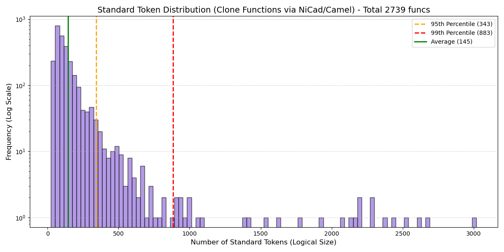
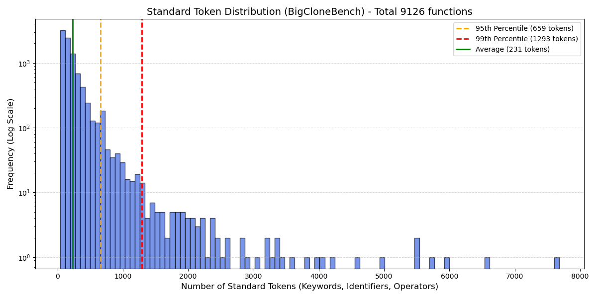

# Code Clone Dataset Analysis Report

This document summarizes the audit and analysis performed on the filtered Java code clone dataset (Apache Camel) and the reference BigCloneBench dataset using a suite of Python forensic scripts.

## 1. Clone Group Distribution Analysis (Verified)
**Tool:** `display_clone_data.py`

* **Objective:** To verify the structural composition of the dataset after filtering.
* **Status:** **Cleaned.** The distribution confirms that large clone groups (super-clusters, e.g., > 20 clones) have been successfully filtered out to prevent overfitting.
* **Visualization:** The histogram below shows the frequency of clone group sizes in the current filtered dataset.

## 2. Token Usage & Logical Complexity Analysis
**Tool:** `display_plot_clone_func_stats.py` & `display_plot_bigclonebench_stats.py`

* **Metric:** **Standard Token Count** (Keywords + Identifiers + Operators).
* **Scope:** Represents the "Logical Size" of the code.
* **Critical Note on Inflation:** The graphs below display the token count based on logic only (after comment removal). They do **NOT** yet account for **Whitespace/Indentation Inflation**. The actual BPE token count seen by the model will be **significantly higher (approx. 2x - 3x)** due to the preservation of indentation in the current dataset.

### A. Clone Function Dataset (Apache Camel)
* **Visualization:** Distribution of logical token counts for the filtered clone pairs/groups.
* **Status:** Functions appear logically concise, but require `block_size` buffer for whitespace.

### B. BigCloneBench Dataset (Reference)
* **Visualization:** Distribution of logical token counts for the larger BigCloneBench dataset.
* **Observation:** Notice the "Long Tail" of extremely large functions, which contrasts with our filtered Camel dataset.

## 3. Data Cleanliness & Comment Analysis
**Tool:** `check_comments.py` & `display_min_tokens.py`

* **Objective:** To quantify noise (comments) and confirm the "Whitespace Inflation" phenomenon.
* **Findings:**
    * **Whitespace Inflation:** Small functions often register **100+ BPE tokens** due to indentation (spaces/tabs), confirming the gap between the "Logical Graphs" above and the actual "Physical Input".
    * **Comment Ratio:** Analysis reveals the percentage of functions containing comments.
* **Detailed Reports:**
    * See `min_tokens.html` for the smallest functions (highlighting indentation impact).
    * See `check_comments_clone_func.html` for comment stripping verification.

---

### Summary of Actions & Recommendations
1.  **[Completed] Filter Super-Clusters:** Large groups have been filtered out, ensuring a balanced dataset (as seen in Section 1).
2.  **[Recommended] Strip Comments:** Use the regex-based stripping logic to further reduce token usage and focus the model on code logic.
3.  **[Recommended] Block Size Configuration:**
    * **Logical Limit:** The graphs show ~400 Standard Tokens covers the vast majority (95th percentile).
    * **Physical Limit (BPE):** Due to whitespace inflation, a `block_size` of **512** is the minimum safe requirement to accommodate the indentation overhead of these logical tokens.