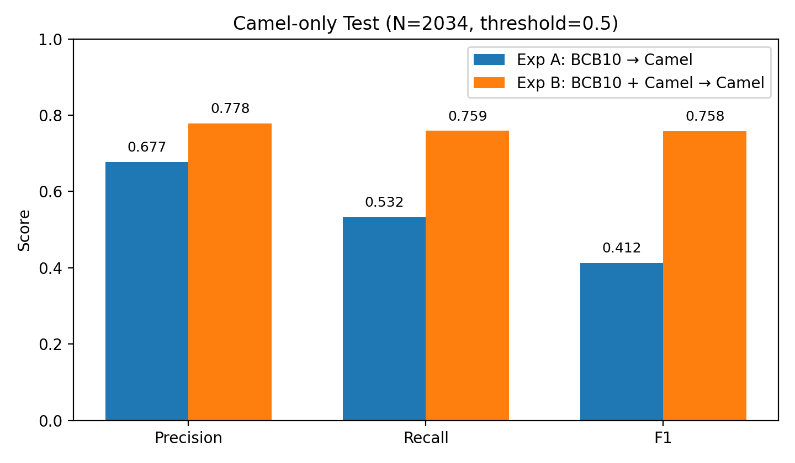
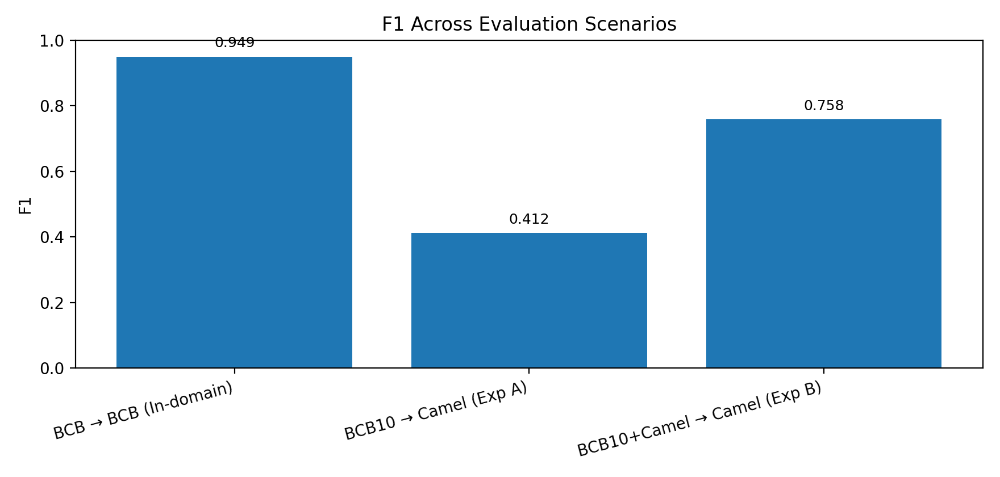
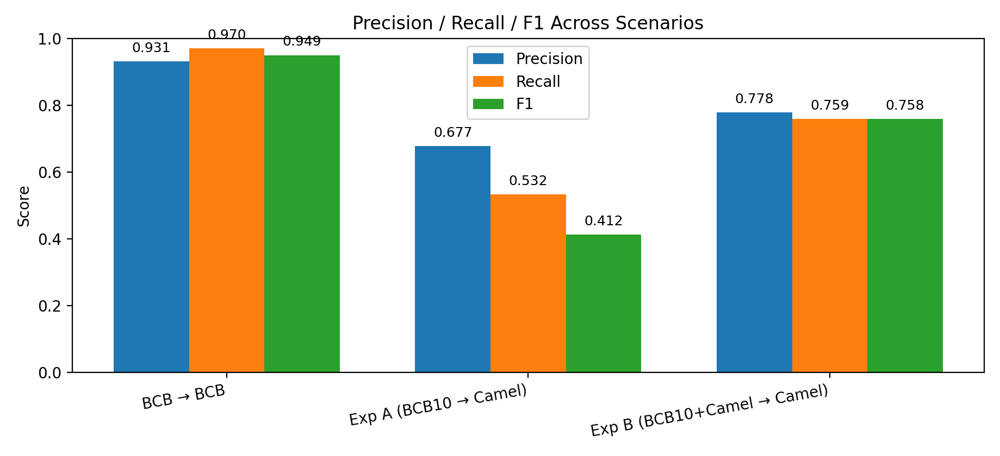
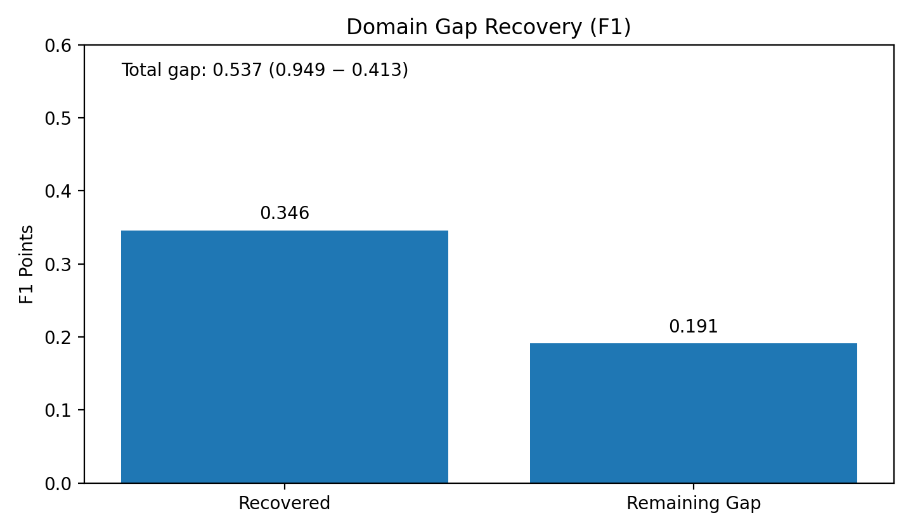
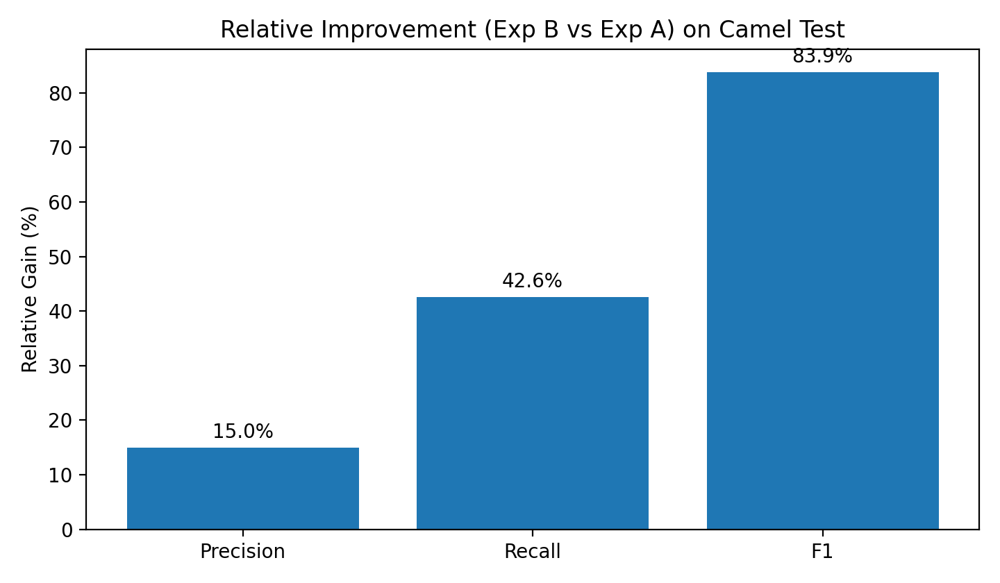

# Cross-Domain Fine-Tuning Comparison (CodeGPT)

**Date:** 2026-02-06  
**Model:** CodeGPT-small-java  
**Task:** Cross-project code clone detection  
**Source Domain:** BigCloneBench (BCB)  
**Target Domain:** Camel (NiCad post-processed)

---

## 1. Overview

This document presents a controlled comparison of CodeGPT fine-tuning strategies
for **cross-domain code clone detection**.

We evaluate how well a model trained on **BigCloneBench (BCB)** generalizes to a
different project/domain (**Camel**), and how much of the domain gap can be
recovered through **target-domain adaptation**.

---

## 2. Datasets

### 2.1 Training / Validation (Same for All Experiments)

- **BigCloneBench (BCB) 10% subset**
- Balanced labels (0/1)
- Files:
  - `train_10percent.txt`
  - `valid_10percent.txt`

### 2.2 Test Sets

- **BCB Test (In-domain reference)**
  - Used to establish an upper bound

- **Camel-only Test (Cross-domain evaluation)**
  - File: `test_camel.txt`
  - **Number of test examples:** 2,034

### 2.3 Code Mapping

- Unified mapping file:
  - `mix/data.jsonl`
- ID namespaces:
  - `bcb_<id>` for BigCloneBench
  - `camel_<id>` for Camel

This guarantees that all train/valid/test pairs are resolvable under a single
mapping without ID collisions.

---

## 3. Experimental Setup

### Common Settings

- **Backbone model:** `microsoft/CodeGPT-small-java-adaptedGPT2`
- **Decision threshold:** 0.5
- **Evaluation metrics:** Precision, Recall, F1
- **Test type:** `mix` (loads `mix/data.jsonl`)
- **Train / Valid data:** identical across experiments

This setup ensures a **fair and apples-to-apples comparison**.

---

## 4. Experiments

### Experiment A — Cross-Domain Baseline (BCB10 → Camel)

- **Train:** BCB 10%
- **Valid:** BCB 10%
- **Test:** Camel-only
- **Target-domain exposure during training:** ❌ No

This experiment measures how a model trained only on BCB generalizes to the
Camel domain.

---

### Experiment B — Domain-Adapted Model (BCB10 + Camel → Camel)

- **Train:** BCB 10%
- **Valid:** BCB 10%
- **Test:** Camel-only
- **Target-domain exposure during training:** ✅ Yes

This experiment evaluates the effect of exposing the model to Camel data during
fine-tuning.

---

## 5. In-Domain Reference Performance (Upper Bound)

To establish an upper bound, we report the in-domain performance of CodeGPT
trained and tested on BigCloneBench.

| Setup | Precision | Recall | F1 |
|------|----------:|-------:|---:|
| **BCB → BCB (In-domain)** | 0.9314 | 0.9699 | **0.9494** |

This confirms that CodeGPT achieves near-ceiling performance when train and test
domains match.

---

## 6. Cross-Domain Results on Camel

**Camel-only test set (N = 2,034)**

| Model | Precision | Recall | F1 |
|------|----------:|-------:|---:|
| **Exp A: BCB10 → Camel** | 0.6769 | 0.5324 | 0.4125 |
| **Exp B: BCB10 + Camel → Camel** | 0.7781 | 0.7591 | 0.7584 |
| **Δ (B − A)** | **+0.1012** | **+0.2267** | **+0.3459** |
| **Relative Gain (%)** | **+15.0%** | **+42.6%** | **+83.9%** |

---

## 7. Visualization

All figures are stored under the `graph/` directory.

### 7.1 Exp A vs Exp B (Precision / Recall / F1)

  

---

### 7.2 Three-Way F1 Comparison

  

---

### 7.3 Three-Way Precision / Recall / F1

  

---

### 7.4 Domain Gap Recovery (F1 Points)

  

---

### 7.5 Relative Improvement (Exp B vs Exp A)

  

---

## 8. Analysis

- **In-domain (BCB → BCB)** performance is very high (F1 = 0.95), establishing a
  clear upper bound.
- **Cross-domain baseline (Exp A)** suffers a large performance drop (F1 = 0.41),
  mainly due to low recall.
- **Domain-adapted model (Exp B)** recovers a substantial portion of this gap,
  improving F1 to **0.76**.

Overall, domain adaptation recovers approximately **64% of the lost F1
performance** caused by domain shift.

---

## 9. Key Takeaway

> CodeGPT generalizes poorly across domains when trained only on BigCloneBench.
> However, incorporating target-domain (Camel) data during fine-tuning recovers
> most of the performance gap, demonstrating a strong and measurable domain
> adaptation effect for cross-project clone detection.

---

## 10. Reproducibility Notes

- Train and validation data are identical across experiments.
- Test sets are fixed and identical where compared.
- No test data is used during training or validation.
- All performance gains are attributable solely to **target-domain adaptation**.

---

## 11. Artifacts

- `display_fine_tune_all_graphs.py` — script to generate all figures
- `graph/` — directory containing all PNG figures
- `mix/data.jsonl` — unified mapping
- `train_10percent.txt`, `valid_10percent.txt`
- `test_camel.txt`

---