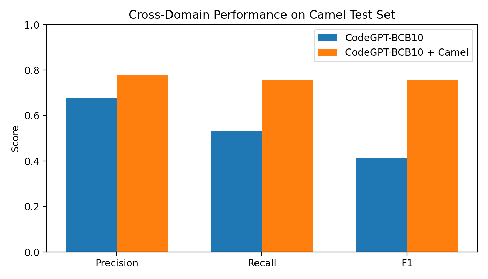

# Cross-Domain Fine-Tuning Comparison (CodeGPT)

**Date:** 2026-02-06  
**Model:** CodeGPT-small-java  
**Task:** Cross-project code clone detection  
**Target Domain:** Camel (NiCad post-processed)

---

## 1. Overview

This document presents a controlled comparison of two fine-tuning strategies
for CodeGPT on a **cross-domain clone detection task**.

Both experiments are trained and validated on the **same 10% subset of
BigCloneBench (BCB)** and evaluated on the **same Camel-only test set**.
The goal is to isolate and quantify the effect of **target-domain adaptation**.

---

## 2. Datasets

### 2.1 Training / Validation (Same for All Experiments)

- **BigCloneBench (BCB) 10% subset**
- Balanced labels (0/1)
- Files:
    - `train_10percent.txt`
    - `valid_10percent.txt`

### 2.2 Test Set (Same for All Experiments)

- **Camel-only clone pairs**
- Generated from NiCad post-processing
- File:
    - `test_camel.txt`
- **Number of test examples:** 2,034

### 2.3 Code Mapping

- Unified mapping file:
    - `mix/data.jsonl`
- ID namespaces:
    - `bcb_<id>` for BigCloneBench
    - `camel_<id>` for Camel

This ensures all train/valid/test pairs are resolvable under a single mapping
without ID collisions.

---

## 3. Experimental Setup

### Common Settings

- **Backbone model:** `microsoft/CodeGPT-small-java-adaptedGPT2`
- **Decision threshold:** 0.5
- **Evaluation metric:** Precision, Recall, F1
- **Test type:** `mix` (loads `mix/data.jsonl`)
- **Train / Valid / Test sizes:** identical across experiments

---

## 4. Experiments

### Experiment A — CodeGPT-BCB10 (Baseline)

- **Train:** BCB 10%
- **Valid:** BCB 10%
- **Test:** Camel-only
- **Target-domain exposure during training:** ❌ No

This experiment measures how well a model trained only on BigCloneBench
generalizes to an unseen target domain.

---

### Experiment B — CodeGPT-BCB10 + Camel (Domain-Adapted)

- **Train:** BCB 10%
- **Valid:** BCB 10%
- **Test:** Camel-only
- **Target-domain exposure during training:** ✅ Yes

This experiment evaluates the effect of exposing the model to target-domain
(Camel) data during fine-tuning.

---

## 5. Quantitative Results

**Camel-only test set (2,034 examples)**

| Model                         |   Precision |      Recall |          F1 |
| ----------------------------- | ----------: | ----------: | ----------: |
| CodeGPT-BCB10 (Exp A)         |      0.6769 |      0.5324 |      0.4125 |
| CodeGPT-BCB10 + Camel (Exp B) |      0.7781 |      0.7591 |      0.7584 |
| **Δ (B − A)**                 | **+0.1012** | **+0.2267** | **+0.3459** |
| **Relative Gain (%)**         |  **+15.0%** |  **+42.6%** |  **+83.9%** |

---

## 6. Visualization

The following figure compares Precision, Recall, and F1 between the two models
on the same Camel-only test set.

  

**Figure 1.** Cross-domain performance comparison between CodeGPT trained only on
BCB 10% and CodeGPT adapted with Camel domain data.

---

## 7. Analysis

- **Experiment A** achieves relatively high precision but suffers from low recall,
  indicating conservative predictions and many missed true clone pairs in the
  Camel domain.
- **Experiment B** substantially improves recall while maintaining strong
  precision, resulting in a large F1 gain.

The improvement is primarily driven by recall (+0.23), suggesting that
target-domain exposure enables the model to capture Camel-specific clone patterns
that are not present in BigCloneBench.

---

## 8. Key Takeaway

> Although both models are trained and validated on the same 10% subset of
> BigCloneBench and evaluated on the same Camel-only test set, incorporating
> target-domain (Camel) data during fine-tuning nearly doubles the F1 score,
> demonstrating a strong domain adaptation effect for cross-project clone
> detection.

---

## 9. Reproducibility Notes

- Train / validation data are identical across experiments.
- Test set size and decision threshold are identical.
- No test data is used during training or validation.
- Performance gains are therefore attributable solely to
  **target-domain adaptation**, not data leakage or evaluation bias.

---

## 10. Artifacts

- `display_fine_tune_result.py` — script to generate the comparison figure
- `fine-tune-camel.png` — saved visualization
- `train_10percent.txt`, `valid_10percent.txt`
- `test_camel.txt`
- `mix/data.jsonl`
