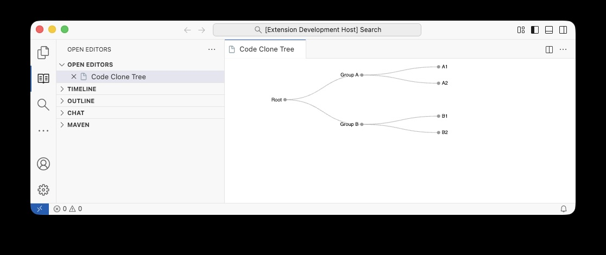

# Clone Drag Refactor Visualizer

A VS Code extension that visualizes code clones as an interactive tree and lets you apply **Extract Method** refactoring directly from the editor — either by clicking a node or by dragging the clone in the file.



---

## Quick Start

### Prerequisites

- [VS Code](https://code.visualstudio.com/) 1.90 or later
- [Node.js](https://nodejs.org/) 20 or later

### Setup

```bash
# 1. Clone or download this folder, then open a terminal inside it
cd clone-drag-refactor-visualizer

# 2. Install dependencies
npm install
```

### Run

1. Open this folder in VS Code (`File → Open Folder`).
2. Press **F5** — VS Code will compile the extension and open a new **Extension Development Host** window.
3. In the host window, open the Command Palette (`Cmd+Shift+P` on Mac, `Ctrl+Shift+P` on Windows/Linux).
4. Run the command **Show Code Clones**.

The clone tree panel opens on the left. The Java source files open on the right when you interact with the tree.

> **After editing source files**, run `npm run compile` and press **F5** again (or run **Developer: Reload Window** inside the host window) to pick up your changes.

---

## Features

### 1 — Browse the clone tree

The tree has four levels:

```
All Code Clones                              ← root
└── camel-java                               ← project
    └── camel_2720_…  [extract · 2 clones]  ← clone group  (orange)
        ├── ExportQuarkus.java  (316-335)    ← clone site   (blue)
        └── ExportGradle.java   (298-317)    ← clone site   (blue)
```

Click any **gray** node to expand or collapse its children.

---

### 2 — Jump to a clone site

**Click a blue leaf node.**

The corresponding Java file opens beside the tree with the clone's lines selected and scrolled into view.

---

### 3 — Apply Extract Method by clicking

**Click an orange clone-group node.**

A confirmation dialog appears listing the files that will be modified. Click **Apply** to replace every clone call site with the extracted method call and insert the new method into the file. The change is **undoable with Ctrl+Z**.

---

### 4 — Apply Extract Method by dragging

This is the signature interaction of the extension:

1. **Click a blue leaf node** — the file opens with the clone highlighted.
2. **Select the highlighted clone code** in the editor.
3. **Drag the selection** to any location below in the same file (e.g., an empty line between two methods).

The extension detects the drag, automatically reverts it (so the file is restored to its original state), then applies the pre-computed Extract Method refactoring for the entire clone group simultaneously. The result is identical to the click-based apply above and is fully **undoable with Ctrl+Z**.

> **If the drag does not trigger**, open **Output → Clone Visualizer — Drag Log** to see what was detected. The most common cause is that the file was not opened by clicking a blue leaf node first.

---

## Project Structure

```
clone-drag-refactor-visualizer/
├── src/
│   └── extension_clone_viz.ts      # All VS Code extension logic
├── media/
│   ├── collapsible-tree.html       # Webview: D3 tree UI
│   ├── d3.min.js                   # Bundled D3 v7 (no CDN needed)
│   ├── all_refactor_results.json   # Clone + refactoring data (input)
│   └── refactor_out/               # Pre-computed refactored file versions
│       ├── camel_2720_…/
│       └── …
├── systems/                        # Java source projects (clone sites live here)
│   ├── camel-java/
│   ├── cassandra-java/
│   └── …
├── dist/                           # Compiled output (generated, do not edit)
├── images/                         # Screenshots used in this README
├── .vscode/
│   ├── launch.json                 # F5 debug configuration
│   └── tasks.json                  # Build task
├── package.json
├── tsconfig.json
└── webpack.config.js
```

No absolute paths are hardcoded. All paths are derived at runtime from the extension's own install location, so the folder works on any machine without any configuration.

---

## How It Works

### Architecture

The extension follows VS Code's two-context model:

```
Extension Host (Node.js)          postMessage          Webview (browser iframe)
extension_clone_viz.ts      ──────────────────►      collapsible-tree.html
                            ◄──────────────────
  • Reads JSON data                                    • D3 collapsible tree
  • Resolves file paths                                • Node click handlers
  • Opens editor tabs                                  • Color-coded nodes
  • Applies WorkspaceEdits
  • Listens for drag events
```

The extension host handles all filesystem access and VS Code API calls. The webview renders the tree and sends click events back via `postMessage`.

### Drag detection

VS Code fires `onDidChangeTextDocument` when the user drags text. The extension identifies a drag by looking for exactly two changes in one event: a deletion (the drag source) and an insertion (the drag destination) with identical content lengths. It then reconstructs the pre-drag document state and applies the structured refactoring on top.

### Undo support

All edits — including the drag revert and the refactoring — are applied via `vscode.workspace.applyEdit(WorkspaceEdit)` rather than direct filesystem writes. This puts every change on VS Code's undo stack so Ctrl+Z always works.

---

## Data Format

The extension reads `media/all_refactor_results.json`, a JSON array where each entry describes one clone group:

```jsonc
{
  "classid": "camel_2720_2658_vs_camel_2720_2660",
  "project": "camel-java",
  "refactoring_type": "extract_method",
  "nclones": 2,
  "sources": [
    {
      "file": "systems/camel-java/dsl/.../ExportQuarkus.java",  // relative to ext root
      "range": "316-335",                                        // 1-based line range
      "replacement_code": "resolveGav(exchange, dep);",
      "enclosing_function": { "fun_range": "290-360", ... }
    }
  ],
  "extracted_method": {
    "method_name": "resolveGav",
    "code": "private void resolveGav(...) { ... }"
  },
  "updated_files": [
    {
      "file": "systems/camel-java/dsl/.../ExportQuarkus.java",
      "rewritten_file_path": "data/refactor_out/.../ExportQuarkus.java"
    }
  ]
}
```

`rewritten_file_path` is resolved against `media/refactor_out/` inside this project. The `data/refactor_out/` prefix in the JSON is stripped automatically.

---

## Troubleshooting

| Symptom | Likely cause | Fix |
|---|---|---|
| White screen in the tree panel | JavaScript error in webview | Open **Developer: Open Webview Developer Tools → Console** |
| "no rewritten files found" warning | `media/refactor_out/` folder missing or incomplete | Make sure the `media/refactor_out/` folder is present |
| Drag does not trigger refactoring | File was not opened via a leaf click | Always click the blue leaf node first, then drag |
| Changes are not reflected after editing source | Old compiled JS still running | Run `npm run compile`, then **Developer: Reload Window** in the host window |
| Ctrl+Z does not undo | Same as above | Run `npm run compile`, then reload |
