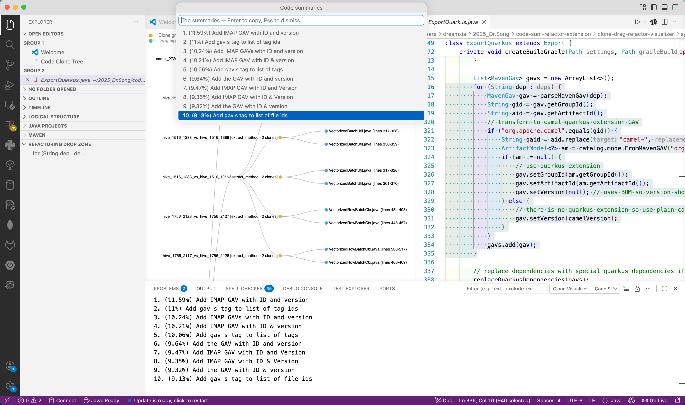

# Code Sum & Refactor Visualizer — User Guide

This repository is a **VS Code / Cursor extension** that combines:

- an interactive **clone tree** (D3) backed by `media/all_refactor_results.json`,
- **Extract Method** workflows (click orange nodes, in-editor drag, or Dropzone-aware drops),
- a **Refactoring Drop Zone** sidebar for snippets,
- **Summarize Selection** via a local Python script (`scripts/summarizer.py`).



---

## Prerequisites

| Requirement | Notes |
|-------------|--------|
| [VS Code](https://code.visualstudio.com/) **1.90+** or **Cursor** (VS Code–compatible) | Used to develop and run the extension |
| [Node.js](https://nodejs.org/) **20+** | For `npm install` and webpack build |
| **Python** (optional, for summarization only) | Used when you run *Summarize Selection*; configure path in settings if needed |

---

## How to run (development)

All steps are from a terminal **in the extension root** (the folder that contains `package.json`).

### 1. Install dependencies

```bash
npm install
```

### 2. Compile TypeScript → `dist/`

```bash
npm run compile
```

For continuous rebuilds while you edit:

```bash
npm run watch
```

### 3. Launch the Extension Development Host

1. Open **this entire folder** in VS Code or Cursor: **File → Open Folder…**
2. Start debugging:
   - If you have a **Run and Debug** configuration for extensions, choose **Run Extension** and start it (often **F5**).
   - If **F5** is not set up yet, use **Run → Start Debugging**, pick **VS Code Extension Development** when prompted, or add a standard `launch.json` that runs the extension type `"extensionDevelopmentPath": "${workspaceFolder}"`.
3. A new window titled **Extension Development Host** (or similar) opens. **Use that window** to try commands and views — your local extension loads only there.

After you change `src/`, run `npm run compile` again (or keep `npm run watch` running), then in the host window run **Developer: Reload Window** so the latest `dist/extension_clone_viz.js` is picked up.

---

## Where to find each feature

Use the **Extension Development Host** window unless you have installed a packaged `.vsix`.

### Feature map (quick reference)

| What you want | Where to go |
|-----------------|-------------|
| **Browse clones & apply refactoring from the tree** | Command Palette → **Show Code Clones** |
| **Jump to a clone in source** | In the tree webview, click a **blue leaf** (file + line range) |
| **Apply Extract Method for a whole clone group** | Click an **orange** clone-group node and confirm **Apply** |
| **Apply refactoring by dragging code in the editor** | Open file via **blue leaf** click → select clone → drag **downward** in the same file |
| **Refactoring Drop Zone (snippet shelf)** | **Primary Side Bar → Explorer** → section **Refactoring Drop Zone** |
| **Add selection to Dropzone** | Select text → **⌘⇧R** (Mac) / **Ctrl+Shift+R** (Win/Linux), or context menu **Add to Dropzone**, or drag selection onto the Dropzone panel |
| **Remove / clear Dropzone items** | Right-click a snippet; or panel title **Clear Dropzone**; **Delete** / **⌘⌫** when the list has focus |
| **Drop a Dropzone snippet into an editor** | Drag an item from Dropzone into the editor (clone-aware if the file was opened from a **blue leaf**) |
| **Summarize selected code** | Select code → editor right-click **Summarize Selection (Code LLM)**, or Command Palette → same command |
| **Read summarizer output** | **View → Output** → channel **Clone Visualizer — Code Summary** |
| **Debug in-editor drag detection** | **View → Output** → **Clone Visualizer — Drag Log** |

---

## Feature details & navigation

### 1. Clone tree (**Show Code Clones**)

1. **⌘⇧P** (Mac) / **Ctrl+Shift+P** (Windows/Linux) → **Show Code Clones**.
2. A panel **Code Clone Tree** opens with a collapsible tree:
   - **Gray** nodes: expand/collapse.
   - **Orange** nodes: clone groups — click to run pre-computed Extract Method (with confirmation).
   - **Blue** leaves: individual clone sites — click to open the file and highlight the range.

Data comes from `media/all_refactor_results.json` and rewritten sources under `media/refactor_out/`.

---

### 2. In-editor drag refactor

1. In the tree, **click a blue leaf** so the correct file opens with the clone selected.
2. **Drag the selection downward** within the same file to where the extracted method should live.

If nothing happens, open **Output → Clone Visualizer — Drag Log** for diagnostics. The extension only handles **drag-down** (insert position after the original range in pre-drag coordinates).

---

### 3. Refactoring Drop Zone (Explorer sidebar)

1. Open the **Explorer** activity (file icon on the left).
2. Scroll to the view **Refactoring Drop Zone**.
3. Add snippets (shortcut, command, or drag into the view). Drag from the view into an editor to insert or trigger clone-aware refactoring (same rules as the main README: file must have been opened from a **blue leaf** for clone-aware drops).

---

### 4. Summarize Selection (Code LLM)

1. Select non-empty code in an editor.
2. Right-click → **Summarize Selection (Code LLM)** (or run the command from the palette).

Requirements:

- `scripts/summarizer.py` must exist (bundled in this repo), or set **Clone Visualizer › Summarizer Script Path** to another `summarizer.py`.
- Python: by default the extension looks for `../code-summarizer/.venv`, then falls back to `python3` / `python`. Override with **Clone Visualizer › Python Path** in **Settings**.

Results appear in the **Clone Visualizer — Code Summary** output channel and in a quick-pick; choosing an item copies that summary to the clipboard.

---

## Settings (`cloneVisualizer`)

| Setting ID | Purpose |
|------------|---------|
| `cloneVisualizer.pythonPath` | Python executable for the summarizer (empty = auto-detect). |
| `cloneVisualizer.summarizerScriptPath` | Optional absolute path to `summarizer.py`. |

Open **Settings**, search for **Clone Visualizer**.

---

## Production packaging (optional)

To build a single installable bundle:

```bash
npm run package
```

Install the resulting artifact with **Extensions: Install from VSIX…** in VS Code, or use your usual packaging flow (`vsce` if you add it).

---

## Related documentation

The main project overview, data format, and architecture live in [`README.md`](README.md). Use this file (`README_code_sum_refactor_viz.md`) as the short **run + UI navigation** guide for the code-sum / refactor / visualization workflow.
