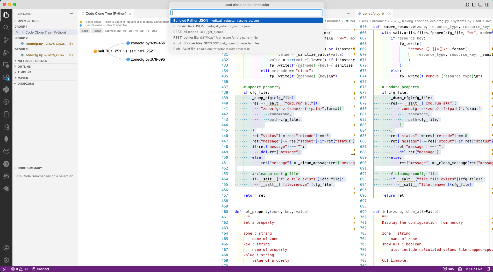
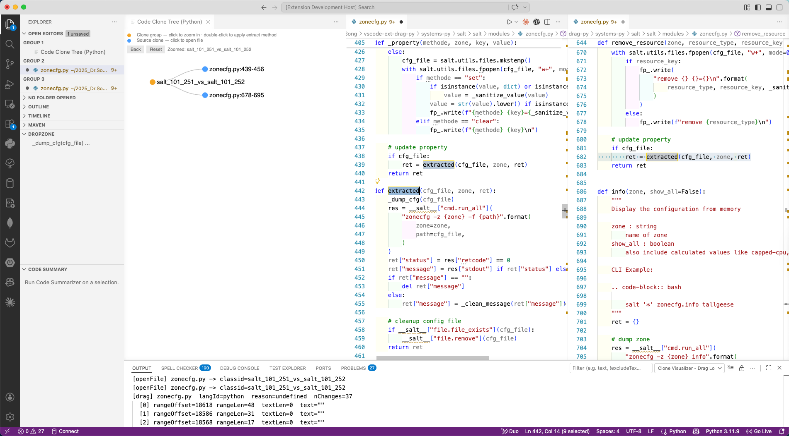
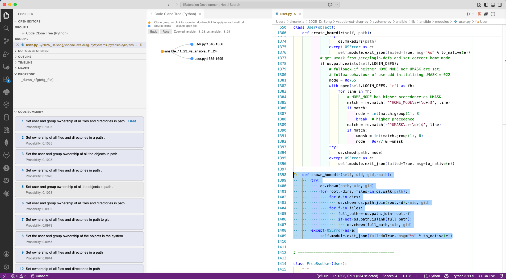

# vscode-ext-drag-py

VS Code extension for experimenting with code-clone visualization, drag/drop clone workflows, Tree-sitter-based Extract Method refactoring, and CodeT5-based code summarization with fine-tuned Hugging Face checkpoints. The main innovation is one-step Extract Method refactoring for clone pairs in the same file: the extension can replace both duplicated regions and insert one shared extracted method in a single operation. It also supports zoom-in/zoom-out clone-tree navigation for scalability and parallel preparation of refactors for multiple clone functions across multiple files. The current implementation is strong for Python refactoring, includes our finetuned CodeT5 model summarizer, and provides Tree-sitter function lookup support.

The project includes:

- A VS Code extension written in TypeScript.
- Bundled clone/refactor result JSON files under `media/`.
- Sample Python systems under `systems-py/`.
- A small local clone API server in `scripts/clone-api-server.js`.
- A Python code summarizer entry point in `summarizer.py`.
- Same-file clone-pair Extract Method refactoring in one operation.
- Zoom-in/zoom-out clone visualization for larger clone trees.
- Parallel processing for preparing multiple clone-function refactors across files.

## Demo

Watch the [project demo video](https://uofnebraska-my.sharepoint.com/:v:/r/personal/44676836_nebraska_edu/Documents/0Research/Research-Dream/2026-journal-submit/vscode-ext-drag-py-Demo.mp4?csf=1&web=1&e=d9rAIa&nav=eyJyZWZlcnJhbEluZm8iOnsicmVmZXJyYWxBcHAiOiJTdHJlYW1XZWJBcHAiLCJyZWZlcnJhbFZpZXciOiJTaGFyZURpYWxvZy1MaW5rIiwicmVmZXJyYWxBcHBQbGF0Zm9ybSI6IldlYiIsInJlZmVycmFsTW9kZSI6InZpZXcifX0%3D).

## Screenshots

### Drag/Drop Refactor Before



### Drag/Drop Refactor After



### CodeT5 Summarizer Results



## Quick Start

From the repository root:

```bash
npm install
npm run compile
```

To run the extension during development:

1. Open this folder in VS Code.
2. Press `F5`, or run the `Run Extension` launch configuration.
3. A new Extension Development Host window opens.
4. In that new window, open this same repository folder.

For clone-visualizer workflows, either use the bundled JSON directly or start the local clone API:

```bash
npm run clone-api
```

Then run `Clone Visualizer: Show Code Clones` from the Command Palette.

## What This Extension Does

### Extract Method

Command:

```text
Refactor: Extract Method (Python)
```

This command extracts a selected Python statement block into a new function or method. It uses Tree-sitter to parse Python, infer inputs and return values, build a new method signature, replace the selected code with a call site, and insert the extracted method after the enclosing function or class.

Example selected block:

```python
if mask is not None:
    _assert_valid_mask(mask)
    sequence_lengths = _compute_sequence_length_from_mask(mask, time_major)
else:
    if time_major:
        batch_dim = tf.shape(inputs)[1]
        max_sequence_length = tf.shape(inputs)[0]
    else:
        batch_dim = tf.shape(inputs)[0]
        max_sequence_length = tf.shape(inputs)[1]
    sequence_lengths = tf.fill([batch_dim], max_sequence_length)
```

Possible result:

```python
sequence_lengths = extracted(mask, time_major, inputs)
```

with a generated function:

```python
def extracted(mask, time_major, inputs):
    if mask is not None:
        _assert_valid_mask(mask)
        sequence_lengths = _compute_sequence_length_from_mask(mask, time_major)
    else:
        if time_major:
            batch_dim = tf.shape(inputs)[1]
            max_sequence_length = tf.shape(inputs)[0]
        else:
            batch_dim = tf.shape(inputs)[0]
            max_sequence_length = tf.shape(inputs)[1]
        sequence_lengths = tf.fill([batch_dim], max_sequence_length)
    return sequence_lengths
```

### Clone Visualizer

Command:

```text
Clone Visualizer: Show Code Clones
```

This opens a webview tree of clone groups. The visualizer can load clone data from:

- `media/all_refactor_results_py.json`
- `media/all_refactor_results.json`
- A custom JSON file
- A REST server compatible with `scripts/clone-api-server.js`

Clicking a leaf opens the corresponding source file and range. Triggering extraction from a clone group applies Tree-sitter Extract Method to the clone sites in that group. For clone pairs in the same file, this is the key workflow: the extension computes the call sites for both duplicated regions, replaces them together, and inserts a single shared extracted method.

The tree webview supports zoom-in, zoom-out, back, and reset navigation so large clone result sets remain browsable. Click clone groups to focus on a subtree, then use the zoom controls to return to the full result tree.

### Dropzone

Commands:

```text
Dropzone: Add Selection
Dropzone: Refactor Selected Clone Groups
Dropzone: Clear
Dropzone: Remove Item
```

The Dropzone view appears in the Explorer sidebar. You can add selected code snippets, drag snippets from the Dropzone back into an editor, and refactor selected clone groups when the snippets match loaded clone data. When multiple clone groups are selected, the extension prepares those clone refactors in parallel and then applies a merged workspace edit, which supports refactoring multiple clone functions across multiple files.

### Code Summarizer

Command:

```text
Code Summarizer: Summarize Selection
```

This runs `summarizer.py` as a Python subprocess on the current selection and displays candidate summaries in the Explorer sidebar. The summarizer uses fine-tuned CodeT5-family Hugging Face checkpoints. The default Python path is configured for the included Conda environment name `code-sum311`.

## Project Structure

```text
.
├── .vscode/
│   ├── launch.json                 # F5 extension-host launch config
│   └── tasks.json                  # npm watch task used before launch
├── media/
│   ├── all_refactor_results_py.json# Bundled Python clone/refactor input
│   ├── all_refactor_results.json   # Bundled Java clone/refactor input
│   ├── data.json                   # Clone data (used by clone API)
│   ├── collapsible-tree.html       # Clone visualizer webview
│   ├── d3.min.js                   # Local D3 dependency for the webview
│   ├── drag-drop-refactor-before.png # Screenshot: drag/drop before refactor
│   ├── drag-drop-refactor-after.png  # Screenshot: drag/drop after refactor
│   ├── summarizer_results.png      # Screenshot: CodeT5 summarizer output
│   └── refactor_out/               # Output directory for refactor results
├── scripts/
│   └── clone-api-server.js         # Local REST server for clone data
├── src/
│   ├── api/
│   │   └── cloneApiClient.ts       # REST client for clone data
│   ├── commands/
│   │   ├── cloneVisualizer.ts      # Clone tree, file opening, clone refactor
│   │   ├── codeSummarizer.ts       # Summarizer command and webview
│   │   ├── dropzone.ts             # Dropzone TreeView and drag/drop logic
│   │   └── extractMethodCommand.ts # Extract Method command and code action
│   ├── languages/
│   │   ├── common/                 # Shared scope/data-flow helpers
│   │   └── python/                 # Python analyzer and code generator
│   ├── parser/
│   │   ├── parserFactory.ts        # Tree-sitter parser creation
│   │   ├── syntaxValidation.ts
│   │   └── treeUtils.ts
│   ├── refactor/
│   │   ├── extractMethodService.ts # Main Extract Method pipeline
│   │   ├── editBuilder.ts
│   │   ├── refactorability.ts
│   │   ├── signatureInference.ts
│   │   └── types.ts
│   ├── utils/
│   ├── extension.ts                # Extension activation entry point
│   └── utilTreeSitter.ts           # Lightweight Python/Java enclosing function helper
├── systems-py/                     # Sample Python projects used by bundled input
├── summarizer.py                   # Python summarizer script
├── environment.yml                 # Conda environment for summarizer dependencies
├── package.json                    # Extension manifest and npm scripts
└── tsconfig.json
```

Generated or installed directories:

```text
out/          # TypeScript build output
node_modules/ # npm dependencies
```

## Input Files

The main clone/refactor inputs are JSON files in `media/`.

### Python Input

```text
media/all_refactor_results_py.json
```

Each record describes one clone group:

```json
{
  "classid": "keras_25_25_vs_keras_25_26",
  "extracted_method": {
    "method_name": "extracted",
    "code": "def extracted(...): ..."
  },
  "sources": [
    {
      "func_id": "keras_25_25",
      "file": "systems-py/keras/keras/src/backend/tensorflow/rnn.py",
      "range": "681-691",
      "code": "...",
      "enclosing_function": {
        "qualified_name": "_cudnn_gru",
        "fun_range": "669-782"
      }
    }
  ]
}
```

Important fields:

- `classid`: clone-group identifier shown in the tree.
- `sources`: clone sites belonging to the group.
- `sources[].file`: path to the source file, usually relative to the repository.
- `sources[].range`: 1-indexed inclusive line range.
- `extracted_method`: optional precomputed refactor information from an external pipeline.

The extension currently recomputes Python edits using Tree-sitter rather than blindly applying `extracted_method.code`.

### Sample Source Files

The bundled Python JSON points into:

```text
systems-py/
```

Examples:

```text
systems-py/keras/keras/src/backend/tensorflow/rnn.py
systems-py/salt/salt/utils/args.py
systems-py/simplejson/simplejson/encoder.py
systems-py/sympy/sympy/polys/modulargcd.py
```

Use these files when trying the bundled clone input.

## Running With Bundled Input

### Option A: Load Bundled JSON Directly

1. Run:

   ```bash
   npm install
   npm run compile
   ```

2. Press `F5` in VS Code.

3. In the Extension Development Host window, open this repository folder.

4. Open the Command Palette and run:

   ```text
   Clone Visualizer: Show Code Clones
   ```

5. Choose:

   ```text
   Bundled Python JSON
   ```

6. The clone tree opens. Click a clone leaf such as:

   ```text
   rnn.py:681-691
   ```

7. Use the tree's extract/refactor action for the clone group. The output channel `Clone Visualizer - Drag Log` shows progress.

### Option B: Serve Bundled Input Through the Local API

Start the server:

```bash
npm run clone-api
```

By default this serves:

```text
media/all_refactor_results_py.json
```

Health check:

```bash
curl http://localhost:8000/health
```

Load all clone groups:

```bash
curl http://localhost:8000/get_clones
```

Load clones for one file:

```bash
curl "http://localhost:8000/get_clone?req_clone_file=systems-py/keras/keras/src/backend/tensorflow/rnn.py"
```

Then, inside the Extension Development Host:

1. Run `Clone Visualizer: Show Code Clones`.
2. Choose `REST: all clones`, `REST: active file`, or `REST: choose files`.
3. The extension requests data from `cloneVisualizer.serverUrl`, defaulting to:

   ```text
   http://localhost:8000
   ```

### Option C: Serve a Different JSON File

Use the `CLONE_DATA` environment variable:

```bash
CLONE_DATA=/absolute/path/to/results.json npm run clone-api
```

Use a different port:

```bash
PORT=8010 CLONE_DATA=/absolute/path/to/results.json npm run clone-api
```

If you change the port, update VS Code setting:

```json
{
  "cloneVisualizer.serverUrl": "http://localhost:8010"
}
```

## Running Extract Method Manually

1. Open a Python file, for example:

   ```text
   systems-py/keras/keras/src/backend/tensorflow/rnn.py
   ```

2. Select a block of complete Python statements.

3. Run:

   ```text
   Refactor: Extract Method (Python)
   ```

4. Enter a method name, or accept `extracted`.

5. The extension replaces the selected block with a call and inserts the new function.

Notes:

- Selection should be one or more complete statements.
- The refactor rejects selections with unsupported control-flow constructs such as `return`, `yield`, or `break` escaping the selection.
- Python is the production Extract Method target in the current codebase.

## Running Dropzone Workflows

1. Select code in an editor.
2. Run:

   ```text
   Dropzone: Add Selection
   ```

3. The snippet appears in the Explorer sidebar under `Dropzone`.
4. Select one or more Dropzone items.
5. Run:

   ```text
   Dropzone: Refactor Selected Clone Groups
   ```

The Dropzone refactor path attempts to match selected snippets to loaded clone records. If multiple matched clone groups are selected, the extension prepares those refactors in parallel before applying the combined edit. This is intended for scaling from a single same-file clone pair to multiple clone functions spread across multiple files.

If no matching clone group has been loaded, use the Clone Visualizer first or make sure the snippets correspond to records in the bundled JSON.

## Running the Code Summarizer

The code summarizer is implemented by:

```text
summarizer.py
```

The VS Code command is implemented in:

```text
src/commands/codeSummarizer.ts
```

The extension sends the selected source code to `summarizer.py` through stdin and expects JSON results on stdout. The script loads a fine-tuned CodeT5-family Hugging Face seq2seq model, generates up to 10 candidate summaries, sorts them by probability, and displays them in the `Code Summary` Explorer view.

Create the optional Conda environment from the file in this repository:

```bash
cd /Users/dreamxia/2025_Dr.Song/vscode-ext-drag-py
conda env create -f environment.yml
conda activate code-sum311
```

The environment file is:

```text
/Users/dreamxia/2025_Dr.Song/vscode-ext-drag-py/environment.yml
```

It defines the `code-sum311` Conda environment used by the summarizer. It includes the main ML dependencies used by `summarizer.py`, including `torch`, `transformers`, `sentencepiece`, and `protobuf`.

The extension settings are:

```json
{
  "codeSummarizer.pythonPath": "/opt/anaconda3/envs/code-sum311/bin/python",
  "codeSummarizer.scriptPath": "",
  "codeSummarizer.model": ""
}
```

If your Conda path differs, update `codeSummarizer.pythonPath`.

To find the interpreter path for your local environment:

```bash
conda activate code-sum311
which python
```

Use that output as `codeSummarizer.pythonPath`.

### Summarizer Models

By default, the extension chooses the model from the active document:

```text
Python files: Dreamuno/llm-codeknowhow-python
Other files:  Dreamuno/llm_codeknowhow_v1
```

These `Dreamuno/*` checkpoints are our fine-tuned CodeT5-family models uploaded to Hugging Face.

You can override this with:

```json
{
  "codeSummarizer.model": "your-huggingface/model-id"
}
```

The first run may download model weights from Hugging Face, so it can take longer and requires network access.

### Use From VS Code

1. Select code in a Python, Java, or text editor.
2. Run:

   ```text
   Code Summarizer: Summarize Selection
   ```

3. Results appear in the `Code Summary` Explorer view.
4. Click a generated summary to copy it to the clipboard.

### Test the Summarizer From the Terminal

You can test the Python script without launching VS Code:

```bash
conda activate code-sum311
echo 'def add(a, b): return a + b' | python summarizer.py --json --stdin --model Dreamuno/llm-codeknowhow-python
```

Expected output is a JSON array:

```json
[
  {
    "summary": "add two numbers",
    "probability": 0.42
  }
]
```

The exact summary text and probabilities depend on the model output.

The script also supports legacy base64 input:

```bash
python summarizer.py --model Dreamuno/llm_codeknowhow_v1 "$(printf 'int add(int a, int b) { return a + b; }' | base64)"
```

### Summarizer CLI

```bash
python summarizer.py --help
```

Useful options:

```text
--stdin              Read UTF-8 source code from standard input.
--json               Print JSON array results to stdout.
--model <model-id>   Hugging Face model id.
base64_input         Legacy base64-encoded source input.
```

The extension normally runs this shape:

```bash
python summarizer.py --json --stdin --model <model-id>
```

## npm Scripts

```bash
npm run compile    # Compile TypeScript into out/
npm run watch      # Compile continuously during extension development
npm run clone-api  # Start local clone-data API on localhost:8000
npm run lint       # Run ESLint
npm test           # Run VS Code test runner
```

## Configuration

Available VS Code settings:

```json
{
  "pythonRefactor.debug": false,
  "cloneVisualizer.serverUrl": "http://localhost:8000",
  "codeSummarizer.pythonPath": "/opt/anaconda3/envs/code-sum311/bin/python",
  "codeSummarizer.scriptPath": "",
  "codeSummarizer.model": ""
}
```

Set `pythonRefactor.debug` to `true` for more verbose internal logs.

## Development Notes

The extension activates on Python and Java files and registers these main surfaces from `src/extension.ts`:

- Extract Method command and code action.
- Dropzone TreeView and editor drop provider.
- Clone Visualizer webview.
- Code Summarizer sidebar.

The Python Extract Method pipeline is:

```text
extractMethodCommand.ts
  -> refactor/extractMethodService.ts
  -> parser/parserFactory.ts
  -> languages/python/pythonAnalyzer.ts
  -> refactor/refactorability.ts
  -> refactor/signatureInference.ts
  -> refactor/editBuilder.ts
```

The clone visualizer refactor path is:

```text
cloneVisualizer.ts
  -> prepareTreeSitterCloneRefactoring(...)
  -> extractMethod(...) for each clone site
  -> one combined WorkspaceEdit
```

Tree-sitter parsers are configured in `src/parser/parserFactory.ts`. A lightweight helper for locating the current enclosing Python function or Java method lives in `src/utilTreeSitter.ts`.

## Troubleshooting

### The extension does not seem updated

Run:

```bash
npm run compile
```

Then reload or restart the Extension Development Host window.

### Clone API request fails

Start the local server:

```bash
npm run clone-api
```

Check:

```bash
curl http://localhost:8000/health
```

If using a custom port, update `cloneVisualizer.serverUrl`.

### Clone Visualizer cannot open a file

Make sure the file paths in the JSON exist relative to the workspace. The bundled Python input expects `systems-py/` to be present in the repository root.

### Extract Method says the selection cannot be extracted

Check that:

- The file is Python.
- The selection is not empty.
- The selection contains complete statements.
- The selection does not include unsupported control flow such as `return`, `yield`, `nonlocal`, `global`, or a `break`/`continue` whose loop is outside the selection.

### `Invalid argument` from Tree-sitter

Recompile after pulling the latest code:

```bash
npm run compile
```

The parser factory sets an explicit buffer size for larger files. If the Extension Host is still running older compiled files, restart it.

### Code Summarizer fails

Verify the Python path:

```bash
/opt/anaconda3/envs/code-sum311/bin/python summarizer.py --help
```

If your environment is elsewhere, change `codeSummarizer.pythonPath`.

## Packaging

To package the extension as a `.vsix`:

```bash
npm run compile
npx @vscode/vsce package
```

Install the generated package:

```bash
code --install-extension code-refactor-visualizer-0.0.1.vsix
```
